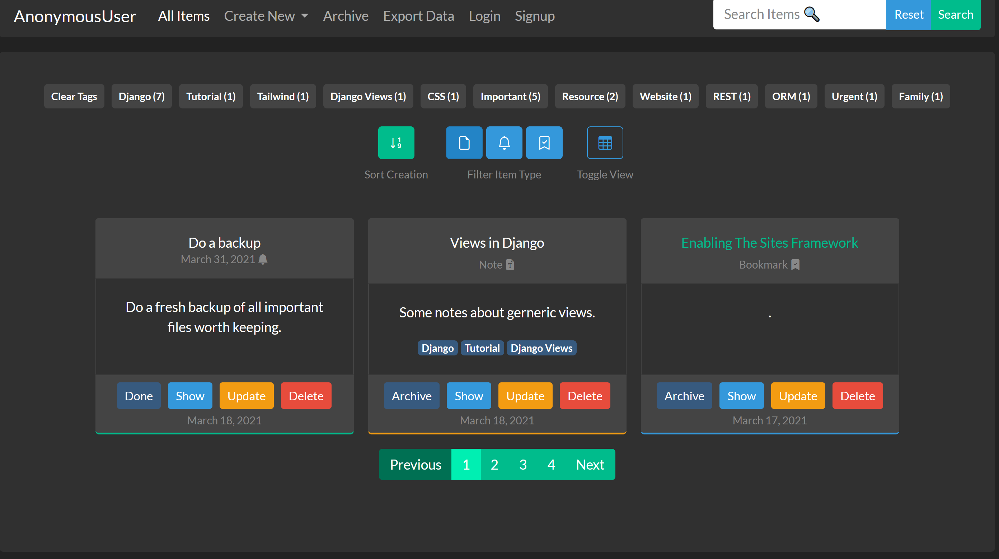
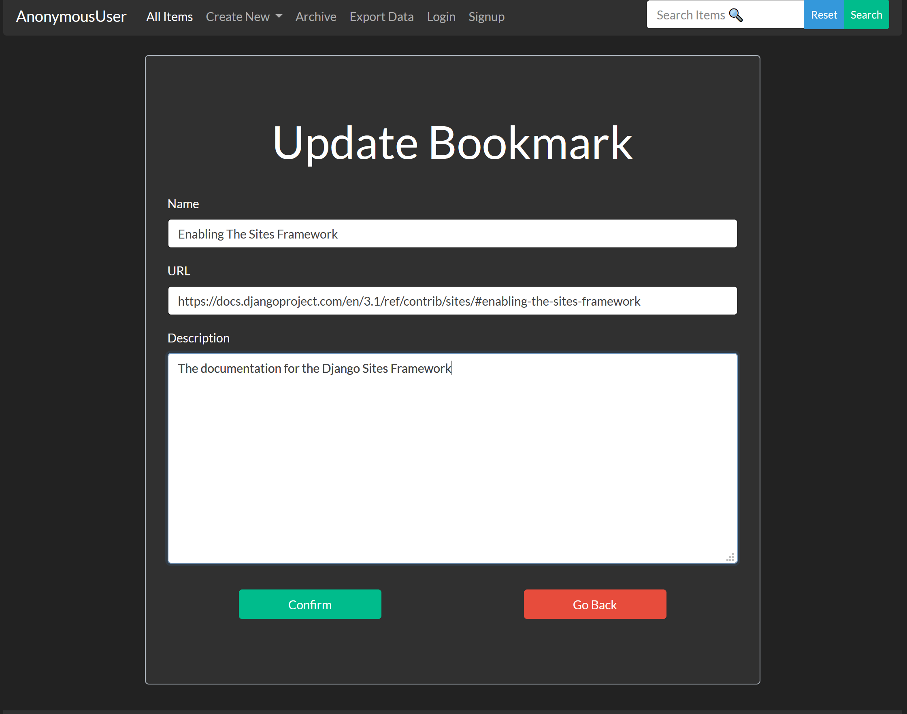
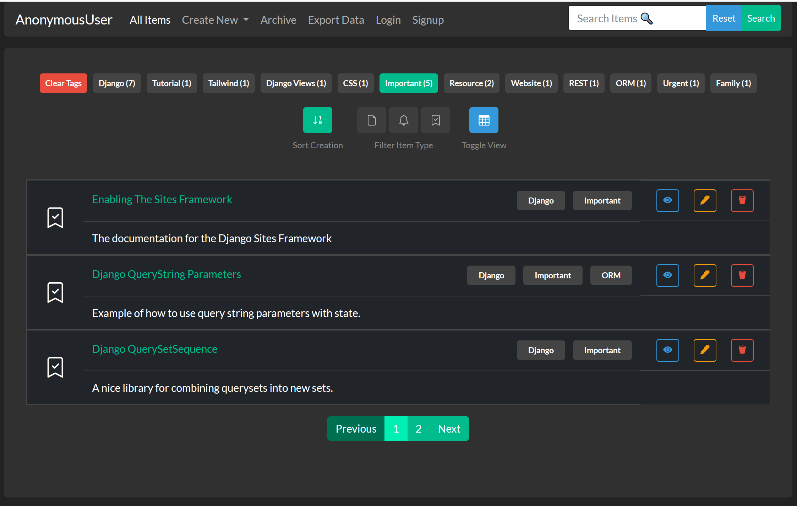
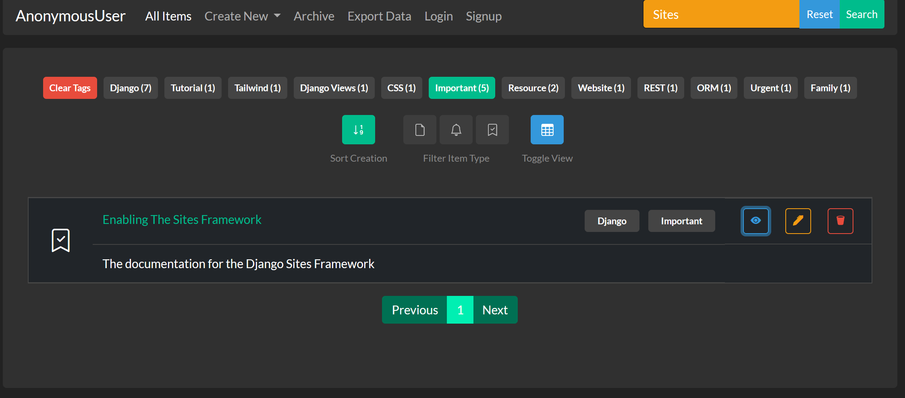

# Django Todo
I made this project to learn Django and working with session storage. I won't be updating or improving it any further.
## What is it?
* A basic todo app with create, read, update, delete and list features.

* Toggle between table and card view and search for content or filter for content type.

* Minor work has been made towards user integration features.

# License
Free for anything. Use this (at your own responsibility and liability) however you like, modify it, fork it, use it for a website.. anything  - no restrictions.
